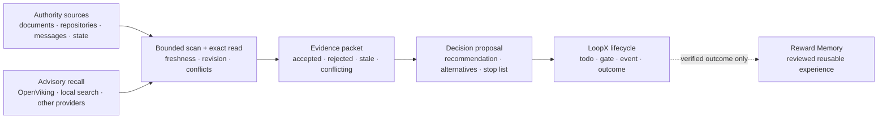

# Decision Context

[中文](README.zh-CN.md) | [Architecture contract](../../reference/protocols/decision-context-architecture-v0.md)

Status: experimental, built in, default off, goal scoped.

Decision Context helps a long-running LoopX agent rebuild **what is currently
true for one decision** before it acts. It combines revisioned authority
sources, bounded provider recall, exact reads, freshness checks, and conflict
handling into an auditable evidence packet. The agent may then produce a
proposal, while LoopX Core remains the only lifecycle and action authority.

It is useful when a goal spans days or weeks and the answer cannot safely come
from the current prompt or model memory alone.

## The Problem It Solves

A long-running agent often has more context than it can keep in one session:

- project state and source documents change independently;
- previous judgments can become stale;
- semantic recall can find useful clues but cannot prove current truth;
- recommendations are easily mistaken for facts;
- a decision is hard to improve if its later outcome is not linked back to the
  evidence that produced it.

Decision Context turns that loose context into a bounded decision cycle:



## What It Owns

Decision Context owns the decision-quality layer:

1. **Incremental source profiles** declare which source classes matter, their
   freshness policy, scan mode, and evidence weight.
2. **Bounded scan and exact read** discover changes without copying raw source
   bodies into LoopX packets.
3. **Evidence rebase** promotes current facts and explicitly records stale,
   rejected, or conflicting claims.
4. **Decision proposals** keep recommendations, alternatives, next actions,
   and stop lists separate from evidence.
5. **Outcome receipts** link an accepted decision to observed outcomes and
   invalidated assumptions.
6. **Cursor commit** advances private source cursors only after the complete
   packet chain and lifecycle writeback have been validated.

## What It Does Not Own

Decision Context does not:

- replace LoopX Core todo, gate, quota, event, or authority semantics;
- turn provider recall into trusted truth;
- automatically capture chats, tool output, credentials, or raw provider
  payloads;
- grant permission to execute a recommendation;
- automatically activate a Reward Memory candidate;
- require OpenViking or any other single provider.

If a provider is unavailable, the capability fails open to the remaining
authority sources and records provider health. It does not block the Core
lifecycle or silently advance source cursors.

The assembly also emits `decision_source_coverage_v0`. This public-safe receipt
summarizes scan status, exact-read completeness, and uncovered P0 sources by
priority. Incomplete P0 coverage does not block safe LoopX lifecycle work, but
the caller must label the conclusion as partial or exact-read the missing
authority through another path. Fail-open must not masquerade as complete
context coverage.

## Three Auditable Outputs

| Output | Answers | Typical contents |
|---|---|---|
| `decision_evidence_packet_v0` | What should the decision trust now? | Changed facts, accepted recall, stale/rejected claims, conflicts, revisions, provider health |
| `decision_proposal_v0` | What should happen next? | Objective scores, recommendation, alternatives, actions, stop list |
| `decision_outcome_receipt_v0` | What happened after the decision? | Accepted decision, transitions, outcomes, invalidated assumptions, review time |

The evidence packet is intended to be deterministic and auditable. The
proposal is explicitly advisory. The outcome receipt is append-only evidence;
only a verified outcome may later become a Reward Memory candidate, and that
candidate still follows Reward Memory review and activation.

## Typical Uses

- Rebase a multi-week engineering or product decision against changed
  repositories, documents, and owner communication.
- Reject a previously recalled claim after an exact read shows that it is
  stale.
- Stop a planned action when the current source revision invalidates its
  premise.
- Keep a recurring decision review quiet when no material source changed.
- Provide revision-bound evidence for another capability, such as Material
  Lifecycle reranking.

This capability is not needed for a one-off answer with one stable source.

## Available Surfaces

Inspect the provider-neutral architecture:

```bash
loopx decision-context architecture --format json
```

Prove the default-off route or inspect an explicitly enabled private profile:

```bash
loopx decision-context inspect-profile \
  --goal-id <goal-id> \
  --agent-id <agent-id> \
  --format json
```

Project an enabled profile without accessing providers:

```bash
loopx decision-context source-manifest \
  --goal-id <goal-id> \
  --agent-id <agent-id> \
  --profile <ignored-private-profile.json> \
  --format json
```

Run bounded scans and exact reads without committing private cursors:

```bash
loopx decision-context prepare-evidence \
  --goal-id <goal-id> \
  --agent-id <agent-id> \
  --profile <ignored-private-profile.json> \
  --decision-id <stable-decision-id> \
  --format json
```

`prepare-evidence` is deliberately read only. Semantic rebase, proposal,
validated LoopX writeback, and cursor commit remain separate acceptance
boundaries.

## Relationship To Other Capabilities

| Capability | Primary question | Relationship |
|---|---|---|
| LoopX Core | What work is authorized and what is its lifecycle state? | Decision Context consumes Core truth and proposes through existing lifecycle contracts. |
| Reward Memory | What verified experience should be reusable later? | Decision Context may consume reviewed memory; verified outcomes may create review candidates. |
| Material Lifecycle | Which materials should be active, archived, rebuilt, or reranked? | Decision Context can supply revision-bound evidence; Material Lifecycle owns the material transition. |
| Context provider | What prior context may be relevant? | Advisory recall only; every promoted claim still needs authority and exact-read checks. |

## Maturity And Adoption Boundary

The public capability currently ships its packet contracts, default-off
activation profile, provider-neutral source contract, bounded evidence
assembly, public-safe projections, validated outcome feedback, and private
cursor-commit boundary.

It is still marked **experimental**. A production integration must provide its
own private source adapters, profile, authority policy, proposal logic, and
validated lifecycle writeback. Public packets must never contain private
locators, source bodies, raw chats, provider payloads, or credentials.

For implementation details and invariants, read the
[Decision Context architecture contract](../../reference/protocols/decision-context-architecture-v0.md).
