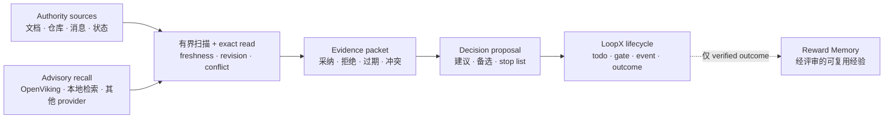

# Decision Context 能力介绍

[English](README.md) | [架构协议](../../reference/protocols/decision-context-architecture-v0.zh-CN.md)

状态：实验能力、内置、默认关闭、goal-scoped。

Decision Context 帮助长程 LoopX Agent 在行动前重建：**针对当前这次决策，
哪些事实仍然可信**。它把带 revision 的 authority source、有界召回、精确读取、
新鲜度检查和冲突处理组装成可审计的证据包；Agent 再基于证据提出建议，而
LoopX Core 仍是生命周期和动作权限的唯一 authority。

当一个 goal 跨越数天或数周，且答案不能安全地只依赖当前 prompt 或模型记忆时，
这项能力最有价值。

## 它解决什么问题

长程 Agent 的上下文通常分散在多个周期和系统中：

- 项目状态和信源文档各自变化；
- 旧判断可能已经过期；
- 语义召回可以找到线索，但不能证明当前事实；
- 模型建议容易被误当成事实；
- 如果决策和后续结果没有关联，就难以校准下一次决策。

Decision Context 把这些松散信息变成一个有边界的决策闭环：



## 它负责什么

Decision Context 负责“决策质量层”：

1. **增量信源 profile**：声明需要关注的信源类型、新鲜度、扫描方式和证据权重。
2. **有界扫描与 exact read**：发现变化，但不把原始正文复制进 LoopX packet。
3. **证据 rebase**：提升当前事实，并明确记录过期、拒绝或冲突的 claim。
4. **决策建议**：把 recommendation、alternatives、next actions 和 stop list
   与事实证据分开。
5. **结果回执**：把接受的决策与真实结果、失效假设关联起来。
6. **cursor commit**：只有完整 packet 链和 lifecycle writeback 验证通过后，
   才推进私有信源 cursor。

## 它不负责什么

Decision Context 不会：

- 替代 LoopX Core 的 todo、gate、quota、event 或 authority 语义；
- 把 provider 召回直接当成可信事实；
- 自动采集聊天、tool output、凭据或原始 provider payload；
- 因为给出建议就获得执行权限；
- 自动激活 Reward Memory candidate；
- 强绑定 OpenViking 或任何单一 provider。

如果 provider 不可用，它会记录 provider health，并 fail open 到剩余 authority
source；不会阻断 Core lifecycle，也不会静默推进 source cursor。

Assembly 还会输出 `decision_source_coverage_v0`。它把每个优先级的扫描状态、
exact-read 完整度和未覆盖的 P0 source 投影为公开安全的回执。`P0 incomplete`
不阻断安全的 LoopX lifecycle，但调用方必须显式标记结论为部分覆盖，或者先通过
其他 authority 路径补齐 exact read；不能把 fail-open 误写成“所有关键上下文已检查”。

## 三类可审计产物

| 产物 | 回答的问题 | 典型内容 |
|---|---|---|
| `decision_evidence_packet_v0` | 这次决策现在应该相信什么？ | changed facts、采纳的召回、过期/拒绝 claim、冲突、revision、provider health |
| `decision_proposal_v0` | 下一步建议做什么？ | objective score、推荐决策、备选方案、行动、stop list |
| `decision_outcome_receipt_v0` | 决策之后实际发生了什么？ | 接受的决策、状态迁移、真实结果、失效假设、复核时间 |

Evidence packet 尽量确定性和可审计；proposal 明确只是建议；outcome receipt
是追加式证据。只有经过验证的 outcome 才可能生成 Reward Memory candidate，
而 candidate 仍需走 Reward Memory 自己的 review 和 activation。

## 典型场景

- 在多周工程或产品决策前，重新核对发生变化的仓库、文档和 owner 沟通。
- 语义召回命中旧信息后，通过 exact read 将其明确拒绝。
- 当前 source revision 推翻原前提时，停止已经规划的动作。
- 周期性决策复核中没有实质变化时，保持 quiet、no-spend。
- 给 Material Lifecycle 等其他 capability 提供带 revision 的排序证据。

如果只是基于一个稳定信源回答一次性问题，通常不需要启用这项能力。

## 当前可用入口

查看 provider-neutral 架构：

```bash
loopx decision-context architecture --format json
```

证明默认关闭，或检查显式启用的私有 profile：

```bash
loopx decision-context inspect-profile \
  --goal-id <goal-id> \
  --agent-id <agent-id> \
  --format json
```

在不访问 provider 的情况下生成公开安全的 source manifest：

```bash
loopx decision-context source-manifest \
  --goal-id <goal-id> \
  --agent-id <agent-id> \
  --profile <ignored-private-profile.json> \
  --format json
```

执行有界 scan 和 exact read，但不提交私有 cursor：

```bash
loopx decision-context prepare-evidence \
  --goal-id <goal-id> \
  --agent-id <agent-id> \
  --profile <ignored-private-profile.json> \
  --decision-id <stable-decision-id> \
  --format json
```

`prepare-evidence` 刻意保持只读。语义 rebase、proposal、经验证的 LoopX
writeback 和 cursor commit 是彼此独立的验收边界。

## 与其他能力的关系

| 能力 | 核心问题 | 与 Decision Context 的关系 |
|---|---|---|
| LoopX Core | 哪些工作已获授权，生命周期状态是什么？ | Decision Context 消费 Core truth，并通过现有生命周期契约提出动作。 |
| Reward Memory | 哪些已验证经验值得以后复用？ | Decision Context 可消费经评审的 memory；verified outcome 可产生待评审 candidate。 |
| Material Lifecycle | 哪些素材应活跃、归档、重建或重排？ | Decision Context 提供带 revision 的证据；Material Lifecycle 拥有素材迁移。 |
| Context provider | 哪些历史上下文可能相关？ | 只负责 advisory recall；claim 仍需 authority 和 exact-read 校验。 |

## 当前成熟度与接入边界

公开能力已经具备 packet 契约、默认关闭的 activation profile、
provider-neutral source contract、有界 evidence assembly、公开安全投影、
经验证的 outcome feedback 和私有 cursor commit 边界。

它目前仍标记为 **experimental**。生产接入方需要提供自己的私有 source adapter、
profile、authority policy、proposal logic 和经过验证的 lifecycle writeback。
公开 packet 绝不能包含私有 locator、source body、原始聊天、provider payload
或凭据。

更完整的实现细节和不变量见
[Decision Context 架构协议](../../reference/protocols/decision-context-architecture-v0.zh-CN.md)。
