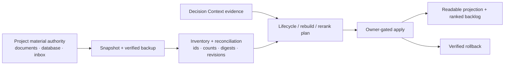

# Material Lifecycle

[中文](README.zh-CN.md) | [Architecture contract](../../reference/protocols/material-lifecycle-architecture-v0.md)

Status: experimental, built in, default off, goal scoped.

Material Lifecycle helps a LoopX-managed project keep a large material store
**lossless, ranked, readable, and reversible** while priorities change. It
governs inventory, backup-safe migration, lifecycle transitions, ranked-entry
rebuilds, bounded reranking, readable projections, owner-gated apply, and
rollback.

It does not own raw documents or private source locations. The project's
existing store remains authority until a verified cutover.

## The Problem It Solves

Material collections grow across candidate lists, archives, documents,
bookmarks, messages, and research tools. Over time:

- a shortlist no longer reflects the current goal;
- one ranked item becomes a bucket containing too many unrelated materials;
- an archive or migration can silently lose content or references;
- a readable Markdown view drifts away from the managed catalog;
- a search provider can add candidates without a clear budget or stop
  condition;
- a rerank is applied without preserving the previous state or explaining why.

Material Lifecycle makes these changes explicit and auditable:



## What It Owns

1. **Snapshot and inventory**: source revision, digest, stable references,
   lifecycle counts, parse errors, and verified backup.
2. **Lifecycle receipts**: explicit transitions among `unread`, `candidate`,
   `active`, `carryover`, and `archived`.
3. **Ranked-entry rebuilds**: split oversized buckets into independently
   sortable entries while preserving exact membership.
4. **Bounded rerank proposals**: protect pinned entries, limit movement, and
   emit a no-change result when evidence is insufficient.
5. **Readable projections**: render an operator-friendly view from the managed
   catalog without turning that view into authority.
6. **Owner-gated apply and rollback**: compare-and-swap, atomic write, readback,
   dual-read reconciliation, cutover receipt, and reversible recovery.
7. **Bounded Explore intake**: only from a named evidence gap, provider budget,
   candidate budget, and stop condition.

## The Core Invariants

- The original source remains authority until verified cutover.
- Every migration starts from an immutable snapshot and verified backup.
- Stable material references survive lifecycle and ranking changes.
- Every selected material appears exactly once in the complete ranked set.
- A ranked entry contains at most three primary materials by default.
- Overflow becomes new independently ranked entries, not a hidden supporting
  index.
- The ranked set may extend beyond a visible Top-N through an explicit ranked
  backlog.
- Recall is advisory; ranking evidence must be promoted by exact read.
- Proposal and apply receipt are separate.
- Apply and rollback require explicit owner gates and revision checks.

## Typical Uses

- Rebuild a reading Top-N whose entries have become oversized topic buckets.
- Migrate a legacy Markdown or database-backed queue without losing bytes,
  records, references, or recoverability.
- Rerank a small window after Decision Context proves that priorities changed.
- Keep a complete ranked backlog while presenting a concise readable view.
- Move a material from candidate to active or archive it with an auditable
  reason and stable source reference.
- Run bounded exploration for a specific evidence gap without turning search
  into unbounded collection.

Ordinary one-off reading, summarization, or web research does not require this
capability unless the project has explicitly activated a managed material
store.

## Project-Local Skill Delivery

LoopX ships the canonical `loopx-material` skill, but deliberately does not
install it into a user's global skill directory. A connected project may
install a managed project-local copy for one or more agent hosts:

```bash
loopx project-skill install \
  --project . \
  --skill loopx-material \
  --surface codex \
  --execute
```

Supported surfaces:

- `codex` -> `.agents/skills/loopx-material/`
- `claude-code` -> `.claude/skills/loopx-material/`
- `opencode` -> `.opencode/skills/loopx-material/`

Repeat `--surface` to install multiple host-native copies in one transaction.
Inspect before or after installation:

```bash
loopx project-skill status \
  --project . \
  --skill loopx-material \
  --surface codex \
  --format json
```

A project-local skill makes the workflow discoverable. It does **not** activate
material-store writes or expand goal authority. The selected goal still needs
an explicit Material Lifecycle profile, source adapter, write scope, and owner
gate.

## End-To-End Workflow

1. **Connect and authorize the goal.**
   Confirm the goal, agent, source authority, write boundary, and project-local
   skill.
2. **Snapshot and inventory.**
   Verify stable IDs, source digest, backup digest, counts, and parse health.
3. **Exact-read decision evidence.**
   Promote only current, authoritative evidence; reject stale or secondary-only
   claims.
4. **Choose the smallest valid change.**
   Use lifecycle transition, bounded rerank, or structural rebuild as distinct
   operations.
5. **Preview and validate.**
   Prove exact coverage, unique membership, protected ranks, readable
   projection, and rollback readiness.
6. **Apply through an owner gate.**
   Recheck revisions, atomically write, read back, reconcile, and switch the
   authority pointer.
7. **Record the receipt.**
   Preserve before/after revisions, counts, verification references, and
   rollback reference.

## Available Surfaces

Inspect the provider-neutral contract:

```bash
loopx material-lifecycle architecture --format json
```

Inspect the managed project skill:

```bash
loopx material-lifecycle skill-status \
  --project . \
  --surface codex \
  --format json
```

The public Python capability exposes deterministic builders and orchestration
for inventory, migration preparation, lifecycle receipts, ranked-entry
rebuild, bounded rerank, readable projection, Explore intent, apply, and
rollback. Concrete legacy parsers, private storage adapters, source profiles,
and provider credentials remain project owned.

## Relationship To Other Capabilities

| Capability | Primary question | Relationship |
|---|---|---|
| Decision Context | What current evidence justifies a priority change? | Supplies revision-bound evidence; does not mutate materials. |
| Reward Memory | What verified ranking or workflow experience is reusable? | May inform policy after review; never overrides current source authority. |
| Content/notes workflow | What artifact should be written or published? | Consumes selected materials; does not own lifecycle or ranking truth. |
| Research provider | What new candidates may exist? | Supplies bounded candidates; cannot advance lifecycle, ranking, or cursor by itself. |
| LoopX Core | What work and writes are authorized? | Keeps goal, todo, gate, event, quota, and write authority. |

## Maturity And Adoption Boundary

Material Lifecycle is currently **experimental**. Its generic contracts,
project-local skill delivery, lossless rebuild rules, bounded decision planning,
readable projection, and owner-gated apply/rollback orchestration are
implemented and tested.

A real project integration must still provide its private source parser or
adapter, backup implementation, authority pointer, domain scoring, display
records, and owner-approved cutover. Public LoopX packets and commits must not
contain raw material, private paths, private URLs, provider payloads, or
credentials.

For packet schemas and detailed invariants, read the
[Material Lifecycle architecture contract](../../reference/protocols/material-lifecycle-architecture-v0.md).
