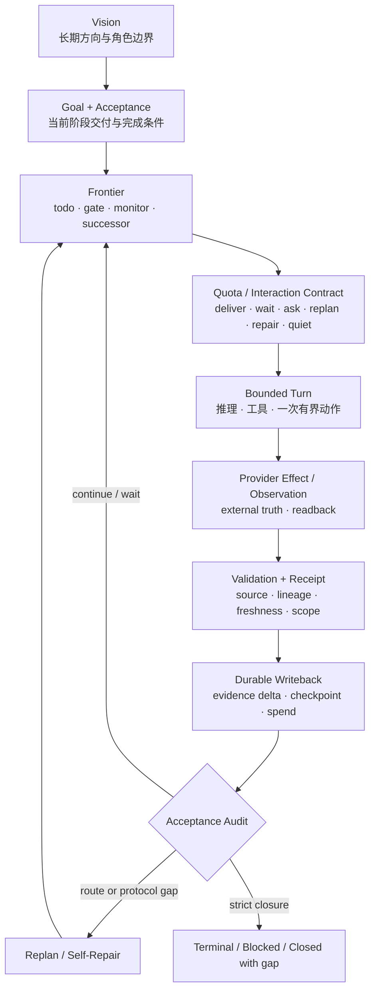

# 专题讲：长程任务如何收敛：不跑偏、不陷入局部循环

> **本讲结论：** 长程任务的稳定性不来自一次更长的推理，也不来自让 Agent 永远保持活跃。
> 它来自一组跨 Turn 持续成立的收敛合同：方向由 Vision、Goal 与 Acceptance 约束，工作由
> Frontier 选择，外部动作由 Authority 与 Receipt 约束，进展由 Durable Evidence Delta
> 定义；当证据不再增加或路线失效时，系统进入 Wait、Replan 或 Self-Repair，而不是重复
> 同一个动作。

建议时长：60 分钟。问题定义 8 分钟、核心闭环 12 分钟、防跑偏 10 分钟、防循环 12 分钟、
双 Showcase 回放 10 分钟、接入边界与问答 8 分钟。

本讲是一篇可以独立分享的课程专题。第一次接触 LoopX 的读者不必先读完第 0 到第 9 讲；
需要补充概念时可回到[概念导读](00-concept-primer.md)，需要进入实现时再沿本讲末尾的阅读
路线下钻。

## 这堂课回答什么

“长程、复杂任务如何不跑偏、不陷入局部循环”包含两个不同问题：

1. **方向问题**：Agent 做了很多局部正确的事，当前 Todo 却逐渐替代了原始目标；
2. **活性问题**：Agent 没有偏离目标，却在同一失败、同一等待或同一类候选上重复消耗。

两者不能只靠更好的 prompt 解决。Prompt 可以提醒当前模型，但不能保证提醒跨 session、
runtime、Agent handoff 和外部状态变化继续成立。也不能仅靠一个终点 Judge 解决：
Judge 可以判断“是否完成”，却未必能告诉下一轮“路线为什么失效、应该改变什么”。

本讲完成后，开发者应该能够：

1. 区分目标漂移、局部循环、合法重试、外部等待与探索收缩；
2. 解释为什么 Turn 是执行窗口，Accepted Transition 才是进展单位；
3. 用方向、权限、证据、Delta、活性和终局六条不变量审查长程系统；
4. 解释 Replan、Self-Repair、Monitor Backoff 和 Explore 各自解决哪类停滞；
5. 把 PR Issue Fix 与 Auto Research 映射到同一套收敛闭环；
6. 判断 LoopX、领域 Capability、Provider、Evaluator 与现有 Agent Runner 分别必须提供什么。

本讲不承诺：

- 给任意模糊目标自动生成正确验收标准；
- 让模型的每次方案判断都正确；
- 用一个通用 planner 替代领域 evaluator；
- 让 Graph、Harness、scheduler 或 supervisor 获得隐藏的执行权限；
- 把“运行时间更长”直接解释为“结果质量更高”。

## 一小时讲授路线

| 时间 | 主问题 | 讲授产物 |
| --- | --- | --- |
| 0-8 分钟 | 什么叫跑偏，什么叫局部循环？ | 四类运行状态与两个反例 |
| 8-20 分钟 | 多个短 Turn 怎样构成一个长程闭环？ | 一张总图与六条不变量 |
| 20-30 分钟 | 怎样约束方向而不冻结计划？ | Vision -> Goal -> Acceptance -> Frontier |
| 30-42 分钟 | 怎样识别空转并退出局部最优？ | Evidence Delta、Backoff、Replan、Self-Repair |
| 42-52 分钟 | 同一机制怎样覆盖工程交付与研究探索？ | Issue Fix / Auto Research 并行回放 |
| 52-60 分钟 | 怎样嵌入现有 Runner，哪些能力仍不成熟？ | 最小接入合同、能力边界与问答 |

讲授时只保留一张主闭环图。代码路径、CLI 细节和扩展实验留在课后材料，避免把这一小时
讲成模块目录巡礼。

## 开场：两种“看起来一直在推进”

先看两个经过公开安全抽象的失败案例。

### PR Issue Fix：每轮都在修，CI 仍停在同一个失败

一个 Agent 收到公开 issue 后完成复现、修改和本地测试，创建 PR。CI 失败后，它再次读取
日志、修改代码、推送；下一轮仍是相同 failure family。连续几轮都有 diff、commit 和命令
输出，但关键事实没有变化：

- 失败来自错误的测试环境，不来自候选 patch；
- 新 commit 没有增加能区分这两种解释的证据；
- 每轮 Agent 都把“有新 diff”当成“更接近 issue acceptance”；
- 没有 successor、diagnostic branch 或 route correction 被写回。

这是局部循环。Agent 没有忘记“修复 issue”，却把“继续改代码”固化成唯一动作。

### Auto Research：dev 指标持续改善，研究目标悄悄变成了 dev 指标

另一个 Agent 围绕 research contract 提出假设并运行实验。多个候选在 dev set 上改善，
于是系统不断扩展同一类近邻方案。它看起来在产生越来越好的结果，但：

- holdout 没有运行，或者 evaluator 与候选共享了受保护信息；
- primary metric 与 guardrail 没有形成 matched comparison；
- negative result 没有进入 evidence graph，近邻方案不会被排除；
- “dev lift”逐渐替代了“满足 research acceptance”。

这是目标漂移。每个实验都可能执行正确，但优化代理指标的过程已经离开原目标。

两个失败的共同点，不是模型不够聪明，而是系统没有把“什么约束方向、什么构成新证据、
什么变化才值得再花一轮”变成可继承的状态。

## 先区分四种运行状态

长程系统不能把所有未完成都称为“继续”。至少要区分四种状态：

| 状态 | 核心特征 | 正确处理 |
| --- | --- | --- |
| 合法迭代 | 新输入、新 revision 或新 evidence 使下一步可区分 | 继续一个 bounded Turn |
| 外部等待 | 当前没有可执行动作，但恢复条件和下一观察时间明确 | Monitor、backoff、quiet |
| 目标漂移 | 局部代理目标开始替代 Goal/Acceptance | Vision checkpoint、acceptance audit、replan |
| 局部循环 | 动作重复，但没有新增信息、状态 Delta 或失败区分度 | Stop repeating、diagnose、replan 或 self-repair |

“重复”本身不是错误。CI 从 pending 变成 failed 后再次处理是合法迭代；外部训练任务未结束时
按 due time 轮询也是合法等待。循环的判定依赖三件事：

1. 输入事实是否变化；
2. 本轮是否产生新的、可归因的 evidence；
3. 下一步计划是否因此发生有意义的变化。

三者都没有变化，却继续执行同一类动作，才是需要治理的空转。

## 工程意义上的“收敛”

本讲使用的收敛不是数学上对任意任务的最优性证明。它是一组可审计的运行性质：

1. 每个 Accepted Transition 都能追溯到稳定 Goal 和当前 Acceptance；
2. 每个消耗资源的 Turn 都产生有效 Evidence Delta，或明确证明为什么只能等待；
3. 未满足 Acceptance 且没有合法 Frontier 时，系统不会永久 quiet，而会产生 Replan 或 Repair obligation；
4. 已满足局部 Todo 但仍有 gate、monitor、successor、vision gap 或 external receipt 缺口时，系统不会误判终局；
5. 当继续工作的预期信息增益不足、权限缺失或风险不可接受时，系统可以诚实地 blocked、retired 或 closed-with-gap。

可以把长程推进压成两个判断：

```text
Safety:
  这次 transition 是否有权限、有证据、作用于正确对象？

Liveness:
  acceptance 尚未满足时，系统是否仍有合法的 next frontier，
  或者已经形成明确的 wait / replan / repair / stop？
```

Safety 防止错误推进；Liveness 防止永远不推进。只做 Safety，系统可能非常谨慎地卡死；
只做 Liveness，系统可能持续产生动作却逐渐越界。长程收敛需要两者同时成立。

## 一张主闭环：Turn 不是进展单位



这张图中最重要的区分是：

```text
Turn       = 一次有界执行窗口
Result     = Turn 返回的产物或观察
Transition = 被验证并允许写入的状态变化
Progress   = 与 Acceptance 相关的 durable transition
```

一个 Turn 可以成功执行却没有 Progress，例如 monitor 到期后发现外部状态未变。一个 Result
也可以有业务价值却不能完成目标，例如 dev metric 提升但缺少 holdout。反过来，一个修复
外部 receipt lineage 的短 Turn，可能没有新代码，却恢复了后续所有 Turn 的正确归因。

因此，长程系统不能用下面这些信号单独计算进展：

- Agent 回复了；
- 命令退出码为 0；
- 创建了文件或 commit；
- 外部任务已经启动；
- Todo 被标成 done；
- scheduler 已经再次唤醒；
- 模型说“下一步继续观察”。

只有 validation、receipt、durable writeback 和 acceptance audit 共同成立，Result 才成为
控制面接受的 Progress。

## 六条收敛不变量

### 方向不变量：每个 Todo 都必须能回到 Acceptance

```text
Vision
  -> Goal boundary
  -> Acceptance
  -> Todo / Frontier
  -> Bounded Turn
```

Todo 可以被替换，计划可以变化，Vision 也可以在新证据下被 patch；但任何当前可执行工作
都应能回答：

- 它在减少哪个 acceptance gap？
- 若成功，哪个事实会变化？
- 若失败，下一轮会增加什么区分度？
- 它为什么属于当前 Agent lane？

不能回答这些问题的 Todo 很可能只是局部方便项。连续出现这类 surface-only work，即使每轮
都小而安全，也可能把系统带离 primary outcome。

### 权限不变量：Proposal、Effect 与 Commit 分开

一个 Agent 可以提出 merge、promotion 或 launch proposal，不代表它有权执行；Provider 执行
了外部 effect，也不代表它有权修改 Goal lifecycle。

```text
proposal
  -> authority and scope check
  -> provider effect
  -> external readback
  -> effect receipt
  -> validated state commit
```

这条边界防止“为了保持活性”而越过安全线。等待 scoped gate 时，独立工作仍可继续；但
不可逆动作必须留在对应 authority 下。

### 证据不变量：Observation 不是 Transition

Evidence 至少要绑定：

- source 和权威事实面；
- goal、todo、agent 或 run identity；
- revision、head、window 或 evaluator contract；
- 时间和 freshness；
- 适用 scope；
- 结果怎样支持、反驳或限制某个判断。

Issue Fix 中，CI 绿色必须绑定 exact head；Auto Research 中，metric 必须绑定候选、数据窗口、
baseline 与 evaluator。脱离这些 identity 的“结果很好”不能安全进入下一轮。

### Delta 不变量：没有 Material Delta，就不把忙碌当推进

Material Delta 可以是：

- 新 artifact 与验证结果；
- 新外部 observation；
- 新 effect receipt/readback；
- successor、supersede、gate 或 blocker；
- acceptance/vision patch；
- confirmed/refuted finding；
- 明确的 no-follow-up 或 terminal evidence。

单纯重写总结、重复 ACK、再次读取同一状态、unchanged monitor poll，都不构成 delivery
progress。它们可以更新 cadence 或 compact counter，但不应消耗与交付相同的 spend。

### 活性不变量：Acceptance 未满足时，Frontier 不能无解释地消失

如果所有 Todo 都 done，但仍存在：

- active monitor；
- blocked successor；
- user/reviewer gate；
- handoff obligation；
- missing vision checkpoint；
- unresolved acceptance gap；
- retryable sink/readback；
- blocker 的 resume route；

系统就不能 terminal。相反，若 acceptance 尚未满足而 runnable frontier 已空，控制面必须
暴露 Replan 或 Repair obligation，不能让 scheduler 永久 quiet。

### 终局不变量：完成、停止与承认缺口都需要证明

长程系统必须允许多个诚实终态：

| 终态 | 所需证明 |
| --- | --- |
| Complete | acceptance 满足，外部 effect 已 read back，frontier 严格关闭 |
| Blocked | 同一阻塞稳定存在，resume condition 或所需 authority 明确 |
| Retired / No-promote | 负向证据足以关闭当前候选或方向 |
| Rolled back | activation 与 rollback receipt 均绑定 exact revision |
| Closed with gap | 剩余缺口、原因和不再继续的依据明确 |

“没有更多想法”不是终态证据；“暂时看不到 Todo”也不是。

## 防跑偏：方向必须外置，但不能冻结

### Vision、Goal、Acceptance 与 Todo 各自回答不同问题

| 层 | 回答的问题 | 不能替代什么 |
| --- | --- | --- |
| Vision | 为什么长期工作，向什么标准收敛？ | 不选择当前 Todo，不授予权限 |
| Goal | 当前阶段要交付什么，边界是什么？ | 不替代 runnable frontier |
| Acceptance | 什么证据允许宣称这一阶段完成？ | 不直接执行验证或 effect |
| Todo | 下一步由谁、在什么条件下做什么？ | 不自行改写长期方向 |

这条约束链让计划可以灵活变化，同时保持目标连续。它也解释了为什么“写一份大计划然后一直
执行”不是长程控制面：外部事实变化后，大计划会过期；没有 Vision 和 Acceptance checkpoint，
Agent 只能在旧计划与新聊天之间猜测。

### Vision Checkpoint 不是例行总结

Material closeout 后，系统需要回答三个问题之一：

1. 当前 Vision 是否因新证据而变化；
2. Vision 未变化的理由是什么；
3. 当前 Vision frontier 是否已经被 successor、supersede 或 no-follow-up 正确关闭。

若三者都没有，Todo 即使完成，也可能只证明局部工作结束。Vision checkpoint 的作用是迫使
系统比较“这轮实际推进”与“长期方向”，防止局部产物悄悄成为新目标。

### 两个 Showcase 的方向锚点

| 约束层 | PR Issue Fix | Auto Research |
| --- | --- | --- |
| Vision | 把公开问题推进到可审阅、可验证、明确终局 | 围绕 research contract 增加可信知识或达到目标指标 |
| Goal | 当前 issue、repository、允许变更范围 | 当前 research question、资源与保护边界 |
| Acceptance | focused fix、测试、exact-head checks/review、closeout | metric、baseline、holdout、guardrail、promotion/retirement |
| Todo | reproduce、patch、monitor、review correction | hypothesis、execute、evaluate、holdout、retire/retry |
| Forbidden proxy | “有新 commit”替代“issue 已解决” | “dev lift”替代“research acceptance 已满足” |

方向锚点不是静态不变。Reviewer 改变 public contract、实验否定原假设、用户缩小目标范围，
都可以触发 patch；变化必须形成带 source、scope 和 Delta 的状态，而不是只留在聊天里。

### 人的反馈也必须先分类

同一句“继续”可能表达不同含义：

| 人工输入 | 正确状态落点 |
| --- | --- |
| 允许 exact head 执行 merge | scoped decision receipt |
| 当前修复方向错了 | evidence + replan + successor |
| 这个 run 结果很好 | run-bound reward |
| 以后摘要更短 | reviewed preference candidate |
| 某类失败应先查环境 | procedural experience candidate |

偏好、评价和授权不能混成一个布尔字段。否则人的纠偏会在下一轮被错误扩大，反而成为新的
漂移来源。

## Turn 合同：让有限上下文安全接力

### 每轮只消费当前需要的状态

Canonical state 不应整份塞进模型上下文。Machine host 应显式请求 JSON packet，并让当前
Agent 只看到：

- stable `goal_id`、`agent_id`、selected todo identity；
- 当前 objective、acceptance 和必要 Vision checkpoint；
- 可执行 scope、capability、gate 与 workspace boundary；
- bounded evidence refs；
- 本轮允许的 action 与 writeback contract；
- 下一次 cadence 或 terminal gap。

典型入口是：

```bash
loopx --format json quota should-run \
  --goal-id <goal-id> \
  --agent-id <agent-id>
```

Markdown 可以服务人类阅读，但自编排 Runner 不应解析展示文本恢复控制语义。

### Turn 的最小事务边界

```text
1. read current packet and lineage
2. claim / validate selected work
3. execute one bounded action
4. collect artifact, observation and effect receipt
5. validate source, identity, scope and freshness
6. write durable state delta
7. read back committed state
8. spend only after accepted progress
9. apply scheduler hint and ACK exact proposal when required
```

进程可能在任一步崩溃。恢复不能只靠“再跑一次”：

- effect 前失败，可以从执行前状态重试；
- effect 成功但 receipt 未写回，应先 readback/reconcile；
- writeback 成功但 spend 未结算，应恢复 accounting，不能重做 effect；
- scheduler 已应用但 ACK 丢失，应绑定 proposal identity 补 ACK。

### Turn 当前不需要成为统一 Runtime

不同 host 对 session、tool、cancel、retry 和 process lifecycle 的实现仍可能不同。接入方不必
等待一个包办所有 Agent 的通用 Turn runtime；先对齐四个稳定面即可：

| 稳定面 | 最小要求 |
| --- | --- |
| Identity | host session 能映射到 stable goal/agent/todo |
| Snapshot | 本轮读取的 packet 带 version/lineage |
| Effect | 外部动作有 proposal、authority、readback 与 receipt |
| Commit | validated delta 能写回并读回，失败 phase 可恢复 |

Turn 在这里是控制面交换协议和事务边界，不是要求所有 Agent 平台采用同一种执行框架。

### 轻量 Skill 的位置

CLI 是状态与决策 truth；轻量 skill 或 system instruction 负责约束 Agent 使用这份 truth：

- 每轮先读 packet；
- 先 claim，再执行；
- 不从聊天猜 authority；
- 只做 bounded action；
- 验证写回后再 spend；
- required gate 要给用户具体问题；
- quiet 时不制造 delivery。

Codex、Claude Code、自研 Agent 或远端开发机可以用各自方式承载这些行为约束。Skill 的安装
路径不是产品合同，CLI packet、state schema 和 receipt 才是。

## 防循环：先判断“有没有增加信息”

### 可观测信号

局部循环通常不会主动声明自己是循环。控制面需要组合多个信号：

| 信号 | 可能说明什么 | 不能单独推出什么 |
| --- | --- | --- |
| 相同 todo 连续被选择 | successor 或 failure classification 缺失 | Agent 必然无能力 |
| 相同 result hash / observation fingerprint | 外部事实未变化 | monitor 应立即停止 |
| 相同 failure family 重复出现 | route、workspace 或 capability 可能错误 | 业务假设一定错误 |
| 新 artifact 但 acceptance gap 不变 | surface-only progress | artifact 没有任何价值 |
| frontier 为空且 acceptance 未满足 | succession/replan gap | goal 应自动 complete |
| 候选集中在同一近邻 family | exploration diversity 不足 | 应随机扩展所有分支 |
| dev 改善但 holdout 不变 | evaluator 或假设泛化不足 | 模型永远不可改进 |

当前 LoopX 工作流常把连续两轮 no-progress 作为触发 Self-Repair 的操作性阈值。它不是所有
领域的数学定律。昂贵实验、长时间构建和低频外部事件需要领域化 cadence；关键是 streak
必须按 agent lane、monitor target 或 failure identity 归因，不能让一个 lane 的变化替另一个
lane 清零。

### Monitor 必须能 quiet

Monitor 只负责观察权威外部事实：

```text
not due
  -> no poll, no spend

due + unchanged
  -> one bounded poll
  -> update result hash / compact count / next due
  -> quiet, no delivery spend

due + material change
  -> evidence writeback
  -> successor / gate / blocker / terminal candidate
```

Stateful backoff 让“没有变化”成为一等结果。否则固定 heartbeat 会把等待变成热循环，并让
run history、token 和用户注意力都被重复信息占满。

### Replan 不是 Retry

Retry 保持同一路线，只重新执行一次。Replan 必须改变机器可见状态：

- 新增、删除或重排 Todo；
- 创建 successor 或 supersede 旧工作；
- 修改 gate、blocker 或 resume condition；
- patch Acceptance 或 Vision；
- 改变 capability/workspace/provider route；
- 用 evidence 关闭候选或记录 no-follow-up。

```text
ACK only                         -> replan_noop
same action with no new basis    -> retry loop
new evidence + route delta       -> valid replan
```

Replan 的价值不是“想一个新点子”，而是让下一轮看到不同的合法 Frontier。

### Self-Repair 与 Replan 修的不是同一层

| 问题来源 | 应使用 |
| --- | --- |
| 领域路线被证伪、候选空间耗尽、acceptance 改变 | Replan |
| projection 缺字段、scope 错误、claim/lease 漂移 | Self-Repair |
| Provider effect 不确定、receipt 丢失 | Reconcile / Self-Repair |
| 外部状态未变但未来仍可能变化 | Monitor + Backoff |
| 权威判断缺失 | Scoped Gate |

Self-Repair 不能靠降低 gate、猜测缺失 payload 或把失败改名为成功恢复运行。Replan 也不能
用来掩盖控制面本身的错误。

## Explore：让负向证据改变下一轮候选

### Graph 解决“试过什么，为什么不再试”

只保存当前最好分数，会让下一轮重复已失败方案。Explore Graph 保存的是 append-only result
log 及其 projection：

```text
hypothesis --leads_to--> experiment
experiment --supports/refutes--> finding
finding --depends_on--> evaluator contract
negative finding --rules_out--> near-neighbor family
```

Graph 的价值不只是展示研究树，而是保存负向知识和 lineage。它不拥有 Todo、claim、launch、
promotion 或 quota。

### Harness 解决“当前哪些分支更值得产生信息”

Explore Harness 读取：

- 当前 Todo 候选；
- Graph evidence refs；
- expected evidence；
- scope/capability conflicts；
- resource capacity；
- candidate diversity。

它输出 analysis-only portfolio、rank、hazard 和可选 suggested commands。真正执行仍要经过
普通 quota、claim、lease、workspace、Provider effect 与 receipt。

Graph 和 Harness 应独立启用：

| Graph | Harness | 合适场景 |
| --- | --- | --- |
| off | off | 普通确定性交付 |
| on | off | 先积累探索证据和负向知识 |
| off | on | 临时分析候选，不保存 topology |
| on | on | 证据拓扑已经稳定，需要 advisory portfolio |

对 evaluator 尚不清楚、指标不可比较、资源 identity 不稳定的项目，先用 Graph 记录证据，
不要急着启用 Harness。当前 Harness 的稳妥定位仍是只读规划器，不是自动 launch controller。

### 不需要先引入多层级 Agent

单个长期 Agent 同样会遇到候选重复、资源等待和目标漂移。先把一个 Goal、一个 Frontier、
一组 receipt 和一个 evaluator 跑通，通常比先创建 supervisor/child hierarchy 更重要。

多 Agent 只在工作可以形成独立 lane、scope 和 evidence 时增加并发。即使启用多个 equal peer，
也不需要一个永久拥有全局 truth 的中央 Agent；共享 State Kernel 和 per-agent frontier
已经提供协作基础。Planner 或 supervisor 可以提出建议，但不能因此获得 durable leader authority。

## 质量门禁：防止系统自证正确

### 三层证明

复杂任务的结果要同时证明三件事：

| 层 | 问题 | 例子 |
| --- | --- | --- |
| Result | 最终 postcondition 是否满足？ | 测试通过、holdout 达标 |
| Causality | 变化是否由当前候选或 Turn 产生？ | pre 不满足、post 满足、revision/window 匹配 |
| Control plane | 这次 Turn 是否 committed 且有合法 receipt？ | writeback、readback、scope、spend |

若 baseline 在 Agent 执行前就已经满足，即使执行后仍满足，也不能声称本轮产生了 improvement。
若结果通过但 Turn 未 committed，也不能用分数补齐缺失的控制面事实。

### Issue Fix 的独立 Oracle

- issue acceptance 与 repository boundary；
- focused test 与 regression check；
- exact commit/head 的 CI；
- reviewer decision 与 merge readback；
- 终局 issue/PR state。

Agent 的总结可以解释这些证据，不能替代它们。

### Auto Research 的独立 Oracle

- research contract 与 primary metric；
- matched baseline、candidate 与数据窗口；
- dev/holdout 隔离；
- protected evaluator；
- user/global guardrail；
- promotion/retirement gate。

Executor 不能评价并 promotion 自己的 dev-only 结果。Explore Graph 也只能消费 evaluator 已接受
的 finding，不能把 planner 排名转成科学结论。

### 门禁也要按风险分层

不是每轮都运行最昂贵的 Judge。稳定 schema、transition rule 和 identity 先用 deterministic
test；真实 Agent 是否正确理解 packet，再用 actual-default model behavior gate；明确宣称
长程 outcome 提升时，才需要 matched stable/candidate baseline。

门禁过重会让系统停止迭代，门禁过轻会让系统自证正确。风险分层本身也是收敛机制的一部分。

## 双 Showcase 回放：同一套 Kernel，不同领域事实

下面沿同一生命周期并行观察 PR Issue Fix 与 Auto Research。

| 阶段 | PR Issue Fix | Auto Research | 共同不变量 |
| --- | --- | --- | --- |
| 目标合同 | 修复公开 issue，并推进到可审阅、验证充分的明确终局 | 围绕 research contract 形成可验证提升或可信负向结论 | Goal/Acceptance 先于 Todo |
| 初始 Frontier | feasibility、reproduce、patch | curator contract、hypothesis proposal | Todo 有 identity、scope、owner |
| Bounded Turn | 在独立 worktree 修改并跑 focused test | 隔离执行一个 hypothesis | 一轮只交付 bounded action |
| 外部 Effect | push/create PR，读取 exact head | launch experiment，绑定 revision/window | Authority、readback、receipt |
| 等待 | checks/review monitor | external run/holdout monitor | due、result hash、backoff、quiet |
| 新证据 | CI failure、review correction、merge state | dev/holdout result、guardrail、infra failure | Observation 经 Capability 翻译 |
| 局部循环 | 相同失败反复改代码，没有 diagnostic evidence | 重复近邻假设，只优化 dev proxy | 无 Material Delta 不算推进 |
| 路线变化 | repair successor、缩小复现、修 workspace/provider | retire family、切新假设、补独立 evaluator | Replan 必须产生 Frontier Delta |
| 质量门禁 | exact-head tests/review/merge authority | matched holdout/promotion authority | Result、Causality、Commit 分离 |
| 终局 | merged、closed 或 no-follow-up | promoted、retired、retryable blocked 或 closed-with-gap | Strict terminal audit |

### 回放 A：Issue Fix 怎样退出重复 CI 失败

1. `T_fix` 产生 patch 和本地验证，PR receipt 绑定 `head-A`；
2. `M_ci` 到期，权威 observation 显示 failure family `F_env`；
3. Capability 创建 diagnostic successor，而不是直接要求另一个 patch；
4. diagnostic Turn 证明失败来自测试环境与目标配置不一致，形成 provider/workspace route delta；
5. 旧的 patch retry 被 supersede，新的 `T_revalidate` 绑定修复后的环境；
6. `head-A` 的 checks 通过后，merge 仍等待 scoped authority；
7. host 执行 merge 并 readback merged commit，terminal audit 关闭 monitor 与 successor。

退出循环的关键不是“第三次终于改对代码”，而是失败被重新分类，新 Turn 增加了能区分代码
问题与环境问题的证据。

### 回放 B：Auto Research 怎样退出 dev-only 局部最优

1. `H1` 在 dev set 改善，形成 holdout successor，而不是 promotion；
2. holdout 没有改善，Evaluator 产生 `refutes` finding；
3. Graph 把 finding 绑定 evaluator contract，并排除 `H1` 的近邻 family；
4. Harness 读取负向边和当前资源，提出跨 family 的 analysis-only portfolio；
5. Kernel 只暴露满足 scope、capacity 和 quota 的 `H2`；
6. `H2` 的 matched holdout 同时满足 metric 与 guardrail，形成 promotion candidate；
7. promotion gate 和 activation receipt 结算后，Goal 决定继续探索还是严格关闭。

退出局部最优的关键不是随机增加更多 Agent，而是让负向证据真正改变候选空间。

## 自编排 Runner 的最小接入合同

一个已有远端 Agent、custom CLI 或 workflow supervisor 不需要把执行层迁入 LoopX。最小集成
可以保持以下分工：

| 现有 Runner 继续拥有 | LoopX 拥有 |
| --- | --- |
| session、runtime、模型、工具、cancel、process retry | goal、todo、claim、gate、quota、evidence、cadence、recovery |
| workspace 与外部 API 调用 | scope、effect proposal、receipt/readback contract |
| 领域 worker 的具体实现 | 当前合法 frontier 与 accepted transition |

推荐接入顺序：

1. 建立 stable `goal_id`、`agent_id` 与 workspace identity；
2. 把目标、acceptance、authority 和可用 capability 写入 Goal boundary；
3. 每轮显式调用 JSON `quota should-run`，消费 `interaction_contract`；
4. 对 selected todo 执行 claim/lease 与 scope 检查；
5. 运行一个 bounded Turn，不在 Runner 内维护第二套长期 Todo truth；
6. Provider 返回 observation、effect readback 与 typed receipt；
7. 验证后 refresh/writeback，读回 committed state，再结算 spend；
8. 按 scheduler hint 应用 cadence，需要时 ACK exact proposal；
9. 只有 `terminal_no_followup` 或明确 operator decision 才停止长期唤醒。

领域方必须补齐的不是另一套 scheduler，而是：

- 可操作的 Acceptance；
- 权威 observation source；
- effect identity 与 readback；
- evaluator / validation；
- failure attribution；
- domain-specific terminal facts。

如果这些事实仍然只能由人读长日志后主观判断，LoopX 可以先管理 Todo、Gate、Monitor 和
Evidence refs，但不能替领域系统宣布收敛。

更完整的接入路径见[把 LoopX 嵌入你的 Agent Runner](../../guides/custom-agent-runner-integration.zh-CN.md)。

## 什么时候不应启用更复杂的规划

下面几种情况适合先收缩问题，而不是增加 Agent 或 Harness：

1. Acceptance 仍是一句价值判断，没有可观察的 proxy 与人工 gate；
2. Provider 不能返回稳定 task/effect identity；
3. baseline、window、revision 或 evaluator 不可比较；
4. 失败无法区分业务假设、基础设施和权限问题；
5. negative result 没有合法写回位置；
6. 一个 Goal/Frontier 尚未跑通，就准备增加多层 supervisor；
7. planner 输出会直接触发不可逆 effect。

此时最有价值的工作通常是完善 Domain Pack、receipt、evaluator 或 public-safe evidence，
而不是提高 branch width。

## 当前能力边界

LoopX 已经提供的通用机制包括：

- 外置 Goal、Vision、Todo、Claim、Gate、Quota 与 run history；
- agent-scoped Frontier 与 Interaction Contract；
- Monitor、scheduler hint、stateful backoff 与 ACK；
- evidence、effect receipt、refresh、spend 和 terminal audit；
- Replan、Vision checkpoint 与常见 projection Self-Repair；
- default-off Explore Graph/Harness 与领域 Capability Pack 边界。

仍需领域和 host 共同完善的部分包括：

- 高质量 Acceptance 与 independent evaluator；
- 不同外部系统的 effect/readback provider；
- 复杂任务的信息增益或候选多样性度量；
- host-specific Turn recovery 与 cancellation；
- 长程 outcome 的 matched evaluation；
- 高风险动作的 operator authority 与 rollback。

这条边界很重要。控制面可以保证状态不依赖某个 session、动作不静默越权、证据可归因、
停滞可见并可形成下一步；它不能保证任意模型一定找到最优方案。

## 讲授收束：六个问题

面对一个声称可以自主运行数小时或数天的 Agent 系统，先问：

1. **方向**：当前工作怎样追溯到 Vision、Goal 与 Acceptance？
2. **单位**：系统把 Turn、Result、Transition 和 Progress 区分开了吗？
3. **证据**：什么外部 readback 或 independent oracle 允许状态前进？
4. **停滞**：没有新证据时，系统怎样 quiet、backoff、replan 或 repair？
5. **权限**：planner、scheduler、provider 和 Agent 谁能提议，谁能执行，谁能 commit？
6. **终局**：什么条件允许 complete、blocked、retired 或 closed-with-gap？

六个问题都有结构化答案，长程任务才不依赖某个模型“记得初心”或某个人持续充当调度器。

```text
不跑偏：
  每个 Frontier 都受 Vision / Goal / Acceptance 约束。

不空转：
  每个消耗资源的 Turn 都要增加证据、改变状态，或诚实等待。

能恢复：
  每个 Effect 和 Transition 都有 identity、receipt、writeback 与 readback。

能停止：
  Terminal 来自严格 audit，不来自 Todo 为空或 Agent 自述完成。
```

## 延伸实验

这些实验不占一小时主讲时间。

### 实验一：给一次“忙碌但不推进”分类

准备一条 fixture：

- Todo 连续三轮 selected；
- 每轮都有新日志摘要；
- external observation fingerprint 不变；
- acceptance gap 不变；
- 没有 successor、replan delta 或 next due 变化。

要求学习者判断：

1. 哪些字段只是 activity；
2. 哪些字段本应形成 Material Delta；
3. 应进入 wait、replan 还是 self-repair；
4. 本轮是否允许 spend。

### 实验二：为两个 Showcase 写同一张状态表

分别选择：

- PR checks 连续失败；
- dev 提升但 holdout 失败。

为两者填写：

| 字段 | 内容 |
| --- | --- |
| source fact |  |
| current acceptance gap |  |
| selected todo |  |
| accepted evidence |  |
| forbidden inference |  |
| next frontier delta |  |
| terminal condition |  |

若两个案例都能填入同一结构，说明领域事实与 Kernel lifecycle 已经正确分层。

### 实验三：审查一个自研 Runner

沿下面的恢复点主动注入失败：

1. effect 前；
2. effect 后、receipt 前；
3. writeback 后、spend 前；
4. scheduler apply 后、ACK 前。

检查 Runner 是否会重复 effect、丢失 identity、重复 spend 或永久等待。

## 核心代码领读

| 机制 | 入口 | 读代码时要确认 |
| --- | --- | --- |
| 本轮决策 | `loopx/quota.py::build_quota_should_run` | 多种 source facts 怎样收敛成一个 interaction decision |
| Agent-facing packet | `loopx/control_plane/work_items/interaction_contract.py::build_interaction_contract` | selected work、gate、replan、terminal 是否完整投影 |
| Goal frontier replan | `loopx/control_plane/goals/goal_frontier_replan_rules.py::select_goal_frontier_replan_rule` | runnable、gate、succession gap、monitor exhaustion 的优先级 |
| Vision checkpoint | `loopx/state_refresh.py::build_vision_checkpoint` | material closeout 后如何防止局部目标替代长期方向 |
| Turn transaction | `loopx/control_plane/turn_driver/executor.py::run_loopx_turn_once` | phase failure 怎样恢复，何时允许 commit |
| Issue lifecycle | `loopx/capabilities/issue_fix/pr_lifecycle.py::build_issue_fix_pr_lifecycle_monitor_packet` | 外部 PR observation 怎样变成有限 proposal |
| Explore result log | `loopx/capabilities/explore/result_log.py::append_explore_result_events` | finding/edge 怎样幂等保存且不获得执行权 |
| Explore planning | `loopx/capabilities/explore/worker_branch_plan.py::build_explore_worker_branch_plan` | analysis-only 输出怎样受 scope/capacity/gate 限制 |
| Research decision | `loopx/capabilities/auto_research/research_state.py::build_research_decision_candidates` | dev/holdout/negative evidence 怎样形成 promotion、retirement、retry |
| Research completion | `loopx/capabilities/auto_research/research_state.py::build_auto_research_completion_status` | no runnable frontier 为什么不自动等于完成 |

## 代表性验证

1. `examples/control_plane/goal-frontier-replan-rules-smoke.py`
2. `examples/control_plane/monitor-poll-policy-smoke.py`
3. `examples/control_plane/monitor-poll-writeback-smoke.py`
4. `examples/project/goal-vision-refresh-state-budget-smoke.py`
5. `examples/project/goal-vision-replan-contract-smoke.py`
6. `examples/issue-fix-pr-lifecycle-smoke.py`
7. `examples/explore-result-layer-smoke.py`
8. `examples/explore-worker-plan-gate-smoke.py`
9. `examples/auto-research-layered-e2e-acceptance-smoke.py`
10. `tests/control_plane/test_goal_frontier_replan_rules.py`

这些验证分别证明局部机制。要证明“长程收敛”这一组合性质，还需要把方向、evidence、
frontier、cadence、authority 和 terminal 放在同一条 case trace 中推演，不能只看一个
happy-path smoke。

## 延伸阅读

1. [概念导读：先把 LoopX 放进一张图](00-concept-primer.md)
2. [第 0 讲：从三个 Showcase 理解 LoopX 架构](00-goal-control-plane-architecture.md)
3. [第 1 讲：从 Showcase 到第一次真实 Loop](01-first-real-loop.md)
4. [第 5 讲：Host、Heartbeat 与 Stateful Backoff](05-host-scheduler-and-heartbeat.md)
5. [第 6 讲：证据、Refresh 与 Self-Repair](06-evidence-refresh-and-self-repair.md)
6. [第 8 讲：Agent 自主写代码时的分层质量门禁](08-autonomous-agent-quality-gates.md)
7. [第 9 讲：扩展层、Explore 与 Multi-Agent 产品](09-extension-layer.md)
8. [Long-Horizon Agent State Protocol](../../reference/protocols/long-horizon-agent-state-protocol-v0.md)
9. [Goal / Vision / Replan Contract](../../reference/protocols/goal-vision-replan-contract-v0.md)
10. [Core Control-Plane State Machine](../../product/core-control-plane/state-machine.md)

## 课后检查

1. 为什么一个 Turn 成功不能直接证明 Goal 有进展？
2. 合法重试与局部循环最重要的区分是什么？
3. Vision checkpoint 为什么不能被一段“目标未变化”套话替代？
4. Replan 与 Self-Repair 分别修哪一层？
5. Monitor unchanged 时为什么既不能 spend，也不能自动停止 scheduler？
6. Explore Graph 保存负向证据后，为什么仍不能直接创建或 launch Todo？
7. Auto Research 的 dev lift 为什么只允许产生 holdout successor？
8. PR checks 绿色后，为什么 merge 仍需要 exact-head authority 与 readback？
9. 自研 Runner 接入 LoopX 时，最小 Turn 合同包含哪四个稳定面？
10. 哪些事实必须由领域 Capability、Provider 或 Evaluator 提供，LoopX Kernel 不能代替？
