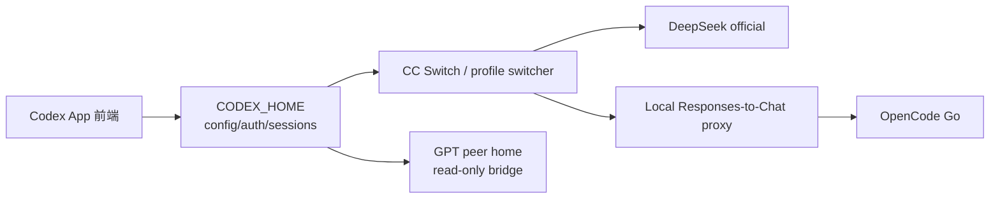

# Codex App 多 Provider 本地切换 Runbook

## 定位

这是一份面向操作者的本地环境 runbook，不是 LoopX capability。它解决一个具体问题：在同一个 Codex App 前端下，把不同的模型 provider 映射到同一个模型 slug，并保持 session、配置、思考过程和工具能力稳定。

LoopX 的 capability 目录要求至少存在一个真实 CLI entrypoint 和一个 smoke test。这份 runbook 目前没有独立 CLI 或可验证的 capability 产物，因此属于 `docs/guides/` 下的操作知识；只有当其中的切换机制被抽象成可安装、可测试的适配器时，才适合升级到 `docs/integrations/` 或 `docs/capabilities/`。

## 目标

- 保持前端始终是同一个 Codex App 实例和同一个 `CODEX_HOME`。
- 在多个 provider 之间切换，不迁移、不混用 session。
- 兼容 Codex 只使用 Responses API 的约束。
- 兼容不同 provider 只有 Chat Completions 上游的情况。
- 避免把 API key 写入可提交文件。
- 避免 GPT/DeepSeek 等不同 session 归属互相污染。

## 非目标

- 不新增 LoopX kernel 状态、todo 语义或调度权限。
- 不处理远端开发机与本地机器的双向同步。
- 不把本地私人配置、key、session id 或日志发布到公开仓库。

## 关键约束

1. Codex App / Codex CLI 的 custom provider 配置中，`wire_api` 当前只支持 `responses`。直接指向只提供 `chat/completions` 的上游不会生效。
2. 同一个 `CODEX_HOME` 下的 session 由 app-server 管理。切换 provider 时如果修改了 session 归属字段，历史会话可能被错误地标记到另一个 provider。
3. ChatGPT/Codex App 的 GPT 官方 session 与第三方 provider 的 session 不兼容。实践中应使用不同的 `CODEX_HOME`，并通过只读 peer bridge 提供跨 home 查阅能力，而不是让两者共享同一份 SQLite 状态。
4. 切换 provider 时，`~/.codex/config.toml` 会被替换或合并。MCP server、项目信任、features 等公共配置需要由 CC Switch 的 common config 或 profile 模板统一维护，避免切换后丢失。
5. 前端显示的模型名可以保持不变，即使底层 provider 变了。这是 feature 而不是 bug：模型 slug 是前端/会话层标识，provider 是请求路由层标识。

## 总体架构



## 组件与目录

建议使用以下目录约定，具体名字可按机器调整，但公开文档中只使用占位符：

```text
<CODEX_HOME>/config.toml
<CODEX_HOME>/auth.json
<CODEX_HOME>/cc-switch-model-catalog.json
<PROFILE_ROOT>/DS/config.toml
<PROFILE_ROOT>/DS/auth.json
<PROFILE_ROOT>/DS/cc-switch-model-catalog.json
<PROFILE_ROOT>/GO/config.toml
<PROFILE_ROOT>/GO/auth.json
<PROFILE_ROOT>/GO/cc-switch-model-catalog.json
<HOME>/Library/LaunchAgents/<service>.plist
```

每个 profile 应包含：

- `config.toml`：完整 Codex 配置，包括公共配置和 provider 专属配置。
- `auth.json`：该 provider 使用的认证。对于走本地代理的 provider，可以只放一个占位 token。
- `cc-switch-model-catalog.json`：完整 model catalog，包含 reasoning summary、tool 支持等元数据，避免被简化 catalog 覆盖。

## 实现细节

### DeepSeek 官方 profile

```toml
model_provider = "custom"
model = "deepseek-v4-flash"
model_catalog_json = "<PROFILE_ROOT>/DS/cc-switch-model-catalog.json"
model_reasoning_effort = "max"
plan_mode_reasoning_effort = "max"
model_reasoning_summary = "detailed"

[model_providers.custom]
name = "deepseek"
base_url = "https://api.deepseek.com"
wire_api = "responses"
requires_openai_auth = true
```

### OpenCode Go profile

OpenCode Go 官方接入点是 Chat Completions，因此本地必须运行一个 Responses-to-Chat 代理：

```toml
model_provider = "custom"
model = "deepseek-v4-flash"
model_catalog_json = "<PROFILE_ROOT>/GO/cc-switch-model-catalog.json"
model_reasoning_effort = "max"
plan_mode_reasoning_effort = "max"
model_reasoning_summary = "detailed"

[model_providers.custom]
name = "opencode-go"
base_url = "http://127.0.0.1:<PROXY_PORT>/v1"
wire_api = "responses"
experimental_bearer_token = "opencode-go-proxy"
```

`experimental_bearer_token` 只是让 Codex 对本地代理发送一个可用的 Authorization 头；真正的上游 key 由代理从环境变量或系统 Keychain 读取，不写入 profile。

### CC Switch provider 记录

CC Switch 的 `providers` 表保存每个 provider 的认证、配置片段和 model catalog。脱敏后的形状如下：

```json
{
  "auth": {
    "OPENAI_API_KEY": "<credential-source>"
  },
  "config": "model_provider = \"custom\"\nmodel = \"deepseek-v4-flash\"\nmodel_catalog_json = \"<PROFILE_ROOT>/GO/cc-switch-model-catalog.json\"\nmodel_reasoning_effort = \"max\"\nplan_mode_reasoning_effort = \"max\"\nmodel_reasoning_summary = \"detailed\"\n\n[model_providers.custom]\nname = \"opencode-go\"\nbase_url = \"http://127.0.0.1:<PROXY_PORT>/v1\"\nwire_api = \"responses\"\nexperimental_bearer_token = \"opencode-go-proxy\"\n",
  "modelCatalog": {
    "models": [
      {
        "model": "deepseek-v4-flash",
        "displayName": "DeepSeek V4 Flash",
        "contextWindow": 1048576
      }
    ]
  }
}
```

`model_catalog_json` 使用 profile 目录的绝对路径，而不是 `CODEX_HOME` 下的副本。这样即使 CC Switch 写入简化 catalog，Codex 仍会加载完整 catalog。

### 本地代理

代理需要满足：

- 只监听 `127.0.0.1`。
- 将 `/v1/responses` 请求转换为上游 `/v1/chat/completions`。
- 保留 SSE 流式输出，并把 reasoning summary 转成 Codex 可识别的 reasoning events。
- 支持 function call / tool call 的往返转换。
- 从环境变量或系统 Keychain 读取上游 key，不在日志中打印 key。
- 不暴露非 localhost 地址。

安装示例：

```sh
uv tool install --from git+https://github.com/<owner>/<proxy-repo> <proxy-bin>
```

Key 存放示例（不记录实际值）：

```sh
security add-generic-password -U -a "$USER" -s <keychain-service> -w <your-key>
```

### LaunchAgent 常驻

```xml
<?xml version="1.0" encoding="UTF-8"?>
<plist version="1.0">
<dict>
  <key>Label</key>
  <string><service-label></string>
  <key>ProgramArguments</key>
  <array>
    <string><HOME>/.local/bin/<proxy-bin></string>
    <string>--bind</string>
    <string>127.0.0.1</string>
    <string>--port</string>
    <string><PROXY_PORT></string>
    <string>--chat-base-url</string>
    <string>https://<provider-domain>/v1</string>
  </array>
  <key>EnvironmentVariables</key>
  <dict>
    <key>HOME</key>
    <string><HOME></string>
    <key>PATH</key>
    <string><HOME>/.local/bin:/usr/local/bin:/usr/bin:/bin</string>
    <key>CODEX_KEYCHAIN_SERVICE</key>
    <string><keychain-service></string>
    <key>CODEX_MODEL_CATALOG</key>
    <string><PROFILE_ROOT>/GO/cc-switch-model-catalog.json</string>
  </dict>
  <key>RunAtLoad</key>
  <true/>
  <key>KeepAlive</key>
  <true/>
</dict>
</plist>
```

加载：

```sh
launchctl bootstrap gui/$(id -u) "$HOME/Library/LaunchAgents/<service>.plist"
```

### 切换脚本行为

切换脚本应做到：

1. 如果 Codex App 正在运行，先向用户确认，再退出 App。
2. 原子复制 profile 的 `config.toml`、`auth.json`、`cc-switch-model-catalog.json` 到 `CODEX_HOME`。
3. 同步 CC Switch 的 `currentProviderCodex` 和 `is_current`，保证 UI 状态一致。
4. 使用 `CODEX_HOME`、`CODEX_ELECTRON_USER_DATA_PATH`、`CODEX_PROFILE_ROLE` 重新拉起同一个前端。
5. 切换命令必须对称：`codex-app-go` 能切到 GO，`codex-app-ds` 能切回 DS。

伪代码：

```text
switch_profile(name, profile_dir, provider_id):
  if app_running:
    ask user for confirmation
    quit app
  apply_profile(profile_dir, provider_id)
  launch_app(CODEX_HOME, frontend_data_dir)
```

## 操作步骤

1. 创建 `<PROFILE_ROOT>/DS` 和 `<PROFILE_ROOT>/GO` 两个 profile。
2. 安装本地代理并存入 Keychain。
3. 注册 LaunchAgent 并确认健康检查返回 `{"status":"ok"}`。
4. 在 CC Switch 中新增两个 Codex provider，config 片段分别指向官方端点和本地代理。
5. 使用 `codex-app-ds` / `codex-app-go` 或 CC Switch 切换。
6. 通过 `codex-app-status`、代理日志、实际发送一条消息来验证。

## 验证

```sh
codex-app-status
curl -sS http://127.0.0.1:<PROXY_PORT>/v1/health
```

Codex 侧验证：

- `config.toml` 中 `base_url` 指向预期 provider。
- 发送消息后，代理日志中出现 upstream `chat/completions` 请求。
- 流式输出中能看到 reasoning summary events。
- 切换前后 session 列表不变。

## 常见排障

| 现象 | 原因 | 处理 |
| --- | --- | --- |
| 前端模型名没变 | 模型 slug 保持不变是设计行为 | 检查 `base_url` 和代理日志确认路由 |
| 切换后仍走旧 provider | App 没有热加载配置 | 重启窗口，或使用带自动重启的切换脚本 |
| reasoning 从 `max` 退回 `high` | CC Switch common config 覆盖 provider 配置 | 将 common config 和 provider config 都固定为 `max / detailed` |
| 上游返回区域限制 | 模型在中国区托管，需要显式 opt in | 在 provider console 开启对应模型 |
| 代理返回 401 | Keychain 或环境变量未配置 | 检查 `security find-generic-password` 或环境变量 |
| 端口被占用 | 代理未退出或已有实例 | 使用 `lsof -i :<PROXY_PORT>` 排查 |

## 脱敏边界

公开 runbook 中允许：

- 架构图、命令形状、TOML/JSON schema、排障规则。
- 公开产品名，如 DeepSeek、OpenCode Go、ChatGPT/Codex App、CC Switch。
- 使用占位符表示路径、key、端口和服务名。

公开 runbook 中不允许：

- 真实 `HOME`、`CODEX_HOME`、profile 绝对路径。
- API key、token、cookie、session id。
- 本地 SQLite 内容、原始代理日志、截图。
- 私人仓库名、账号名、内部文档链接、个人归属信息。

如果这套机制将来被抽象成可安装、可测试的 adapter，应迁移到 `docs/integrations/` 并提供真实 CLI entrypoint 与 smoke test；在此之前保持为 operator runbook。
