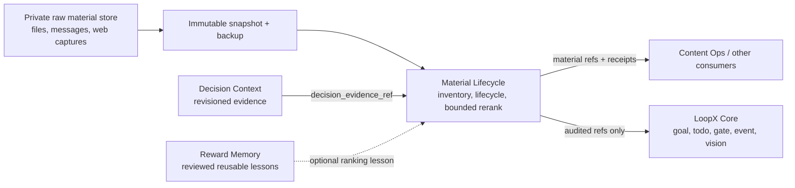

# Material Lifecycle Architecture v0

## Position

Material Lifecycle is a built-in, default-off, goal-scoped LoopX capability.
It owns the auditable lifecycle of material references: inventory, backup-safe
migration, candidate/archive transitions, and bounded rerank proposals. It does
not own raw documents, private source locations, provider credentials, or Core
goal authority.

The capability is a sibling of Decision Context and Reward Memory:

- Decision Context answers which current facts should influence a decision.
- Material Lifecycle answers which material references are candidates, active,
  archived, carried over, or eligible for a bounded rerank.
- Reward Memory stores reviewed reusable policies or lessons.
- Content Ops and other domain capabilities consume selected material; they do
  not own the candidate/archive source of truth.

## Stage-0 Contracts

`material_store_inventory_v0` is a read-only, public-safe inventory. It records
opaque snapshot, backup, digest, revision, count, parse-error, and verification
references. Raw material and private locations are excluded.

`material_migration_plan_v0` fixes the migration order:

1. snapshot;
2. inventory;
3. dual read;
4. reconcile;
5. owner gate;
6. apply;
7. keep rollback ready.

The plan never authorizes source mutation by itself.

`material_lifecycle_receipt_v0` records authority-referenced transitions among
`unread`, `candidate`, `active`, `carryover`, and `archived`. The authority may
be a reviewed goal policy, Decision Context outcome, or human gate. Archive and
reactivation preserve the stable material and archive references instead of
copying raw content into another queue.

`material_rerank_proposal_v0` carries only a bounded delta:

- one target window;
- maximum moved items;
- maximum rank displacement;
- protected material references;
- revisioned Decision Context evidence;
- an explicit no-change result.

`material_rerank_apply_receipt_v0` remains separate from the proposal and
requires an owner-gate reference, validation reference, before/after revisions,
and rollback reference for applied changes.

## Migration Boundary

Legacy Markdown, databases, inboxes, and other stores remain authoritative
until a provider-specific adapter proves:

- an immutable source snapshot and verified backup;
- stable material IDs and source references;
- parse-error accounting;
- equal item counts and lifecycle state under dual read;
- deterministic rerank proposal readback;
- owner-gated cutover and rollback.

The generic capability never embeds a legacy parser or a private file layout.
Adapters may coexist with the old store for as long as reconciliation requires.

## Decision-Driven Ranking and Exploration

Stage 0 accepts an opaque `decision_evidence_ref` from Decision Context. A
later provider-neutral stage may derive a bounded rerank or exploration intent
from that evidence. Search engines, web clients, messaging providers, and
repository scanners remain replaceable providers; their raw output cannot enter
public packets.

This keeps recurring automation thin. A scheduler should wake the goal and
invoke the configured capability. Source lists, incremental cursors, ranking
rules, and exploration budgets belong in ignored goal-scoped configuration and
validated receipts, not in an automation prompt.

## Stage Boundary

Stage 0 ships deterministic contracts, catalog visibility, a read-only
architecture CLI, focused tests, and a public smoke. It does not ship:

- a legacy material parser or migration apply path;
- raw-material persistence;
- an exploration provider;
- a messaging or contact source profile;
- automatic reranking, archive moves, or cursor advancement.

Those require a read-only adapter, private dogfood, exact reconciliation, and an
explicit owner gate.
