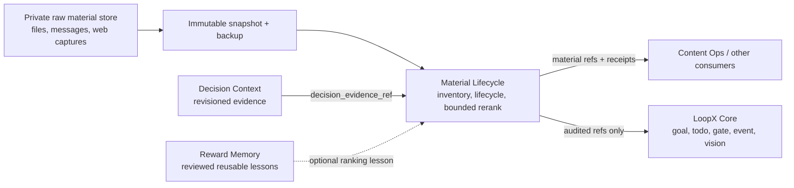

# Material Lifecycle Architecture v0

## Position

Material Lifecycle is a built-in, default-off, goal-scoped LoopX capability.
It owns the auditable lifecycle of material references: inventory, backup-safe
migration, candidate/archive transitions, and bounded rerank proposals. It does
not own raw documents, private source locations, provider credentials, or Core
goal authority.

The capability is a sibling of Decision Context and Reward Memory:

- Decision Context answers which current facts should influence a decision.
- Material Lifecycle answers which material references are candidates, active,
  archived, carried over, or eligible for a bounded rerank.
- Reward Memory stores reviewed reusable policies or lessons.
- Content Ops and other domain capabilities consume selected material; they do
  not own the candidate/archive source of truth.

## Stage-0 Contracts

`material_store_inventory_v0` is a read-only, public-safe inventory. It records
opaque snapshot, backup, digest, revision, count, parse-error, and verification
references. Raw material and private locations are excluded.

`material_migration_plan_v0` fixes the migration order:

1. snapshot;
2. inventory;
3. dual read;
4. reconcile;
5. owner gate;
6. apply;
7. keep rollback ready.

The plan never authorizes source mutation by itself.

`material_lifecycle_receipt_v0` records authority-referenced transitions among
`unread`, `candidate`, `active`, `carryover`, and `archived`. The authority may
be a reviewed goal policy, Decision Context outcome, or human gate. Archive and
reactivation preserve the stable material and archive references instead of
copying raw content into another queue.

`material_rerank_proposal_v0` carries only a bounded delta:

- one target window;
- maximum moved items;
- maximum rank displacement;
- protected material references;
- revisioned Decision Context evidence;
- an explicit no-change result.

`material_rerank_apply_receipt_v0` remains separate from the proposal and
requires an owner-gate reference, validation reference, before/after revisions,
and rollback reference for applied changes.

## Migration Boundary

Legacy Markdown, databases, inboxes, and other stores remain authoritative
until a provider-specific adapter proves:

- an immutable source snapshot and verified backup;
- stable material IDs and source references;
- parse-error accounting;
- equal item counts and lifecycle state under dual read;
- deterministic rerank proposal readback;
- owner-gated cutover and rollback.

The generic capability never embeds a legacy parser or a private file layout.
Adapters may coexist with the old store for as long as reconciliation requires.

## Read-Only Preparation Path

`MaterialInventoryProvider` is the private adapter boundary for legacy stores.
It returns transient metadata as `MaterialStoreSnapshot`: opaque snapshot and
backup references, revision and digest, lifecycle counts, parse-error
references, and three explicit verification results:

- stable material IDs were verified;
- the backup was verified;
- the source digest remained unchanged across inspection.

`prepare_material_migration` converts that transient snapshot into the existing
`material_store_inventory_v0` packet. It creates
`material_migration_plan_v0` only when all three verifications pass and no parse
errors remain. Otherwise it returns deterministic readiness blockers and no
plan. The provider contract has no apply method, and both emitted packets keep
`source_mutation_authorized=false`.

Provider implementations and private file layouts stay outside the generic
capability. A host adapter may parse Markdown, a database, or another source,
but it must prove the same read-only and backup invariants before LoopX will
prepare migration.

## Owner-Gated Apply and Rollback

`MaterialMigrationApplyProvider` is the private write adapter boundary. The
generic capability never receives raw material or a private location. It
orchestrates five explicit steps:

1. compare-and-swap the current authority revision against the prepared source;
2. stage the target store with an atomic write and verified readback;
3. recheck the source authority revision after staging;
4. reconcile stable IDs, item counts, lifecycle counts, and content parity
   under dual read;
5. atomically switch the authority pointer with an explicit owner-gate
   reference.

`material_migration_apply_receipt_v0` records the before/after revisions,
target digest, item and lifecycle counts, reconciliation reference, authority
reference, rollback reference, and the verified CAS/atomic-write/readback
invariants. It remains public-safe and content-free.

Rollback uses the same authority-pointer CAS. It only proceeds while the
currently authoritative revision still equals the applied target revision,
requires a separate owner-gate reference, and emits
`material_migration_rollback_receipt_v0`. The provider owns filesystem,
database, or object-store mechanics; the capability owns ordering, validation,
and auditable receipts.

## Decision-Driven Ranking and Exploration

The provider-neutral decision-planning path accepts a validated, public-safe
`decision_evidence_packet_v0` from Decision Context. A replaceable policy can
derive the existing bounded `material_rerank_proposal_v0` plus an optional
`material_explore_intent_v0`.

The explore intent carries only opaque topic and evidence references. It fixes
maximum topic, provider-call, and new-candidate budgets plus an explicit stop
condition. It is analysis-only: creating it neither calls a provider nor
advances a source cursor. If the policy is unavailable or emits invalid output,
planning fails open to an audited no-change proposal and discards partial
exploration output.

`execute_material_explore_intent(...)` is the explicit read-only execution
boundary. A private host supplies transient queries, a configured
`ContextProvider`, and an execution-authority reference. The executor enforces
the intent's call and candidate budgets, keeps queries, resource locations, and
content in-process, and emits `material_explore_execution_receipt_v0` with only
opaque result references and compact telemetry. Provider failure fails open.

The receipt cannot authorize rerank, candidate insertion, cursor advancement,
or any source mutation. Every hit remains a candidate until an independent
managed-material exact read verifies it against the current authority.

Search engines, web clients, messaging providers, and repository scanners
remain replaceable providers. Their raw queries, output, credentials, and
private locations cannot enter public packets.

This keeps recurring automation thin. A scheduler should wake the goal and
invoke the configured capability. Source lists, incremental cursors, ranking
rules, and exploration budgets belong in ignored goal-scoped configuration and
validated receipts, not in an automation prompt.

## Stage Boundary

The capability now ships deterministic contracts, a provider-neutral read-only
preparation path, owner-gated apply/rollback orchestration, bounded decision
planning and exploration execution, catalog visibility, an architecture CLI,
focused tests, and a public smoke. It does not ship:

- a built-in legacy material parser or private write adapter;
- raw-material persistence;
- a built-in decision policy;
- an exploration provider;
- a messaging or contact source profile;
- automatic reranking, automatic provider calls, archive moves, or cursor
  advancement.

Those require a private read-only adapter, exact dual-read reconciliation, and
an explicit owner gate.
