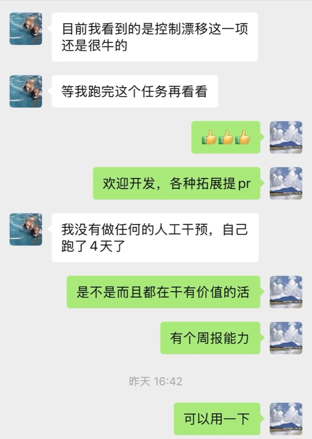

# Independent user: four-day unattended agent run

> **Case type:** Independent user
>
> **Evidence strength:** Owner-approved, minimally redacted user report
> **Runtime / scale:** Four days; one long-running agent reported

## Scenario And Problem

The user was evaluating a long-running agent on an active engineering task.
The practical question was whether the agent could continue useful work without
constant prompting, rather than merely keeping a process alive.

## How LoopX Ran

LoopX kept the task active across a four-day window. The user reported that no
human intervention was required during that period and that the agent continued
doing useful work. A periodic report capability provided a later inspection
point for accumulated progress.

## Human Intervention

The user explicitly reported no intervention during the four-day run. The
surrounding task definition and the later judgment of usefulness remained
human responsibilities.

## Outcome

The user described the work as valuable and highlighted the report surface as a
way to review progress after an unattended interval. There is no public task
repository or run history, so this case does not claim independently reproduced
quality or task completion.

## Evidence

*Source: an owner-approved message excerpt from the LoopX public Lark developer
group, cropped to remove chat identity and unrelated reporting context. All
runtime and outcome claims remain user-reported.*

## Evidence Boundary

The published image is an approved excerpt from the LoopX public Lark developer
group. The workload, repository, run history, report contents, and unselected
chat context remain private. This page preserves only the minimally redacted
excerpt and does not infer facts beyond its text.
